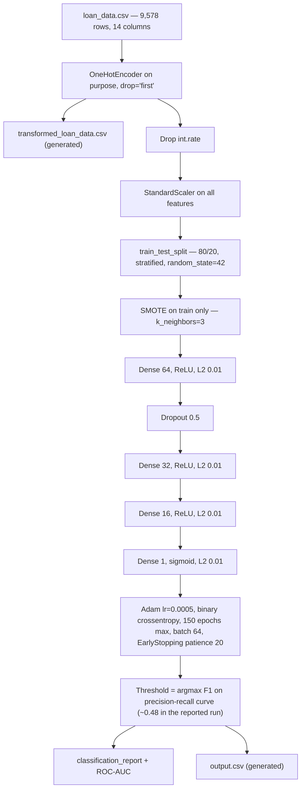

# Loan Default Prediction

A Keras/TensorFlow classifier on imbalanced Lending Club loan rows (2007–2015 style extract, 9,578 rows, about 16% default). The script one-hot encodes loan purpose, drops `int.rate`, scales the numeric features, balances the training split with SMOTE, trains a small dense network, and picks its decision threshold off the precision-recall curve. It reports default-class F1 and ROC-AUC, not just accuracy.

## Results

Reported from the training run documented in the previous README. Not re-run here.

| Metric | Value |
| --- | --- |
| Accuracy | 79% |
| Weighted F1 | 0.79 |
| Default-class F1 | 0.35 |
| Default recall | 36% |
| ROC-AUC | 0.68 |

Default-class F1 of 0.35 is the number that matters on this imbalance, not the 79% headline accuracy. Predicting "paid" for every row scores about 84% accuracy and catches zero defaults.


## Architecture



Dropout is applied once, after the 64-unit layer. L2 (0.01) is on every dense layer including the output.

## Stack

- pandas
- numpy
- seaborn
- matplotlib
- scikit-learn — `OneHotEncoder`, `StandardScaler`, `train_test_split`, `classification_report`, `roc_auc_score`, `precision_recall_curve`, `compute_class_weight`
- imbalanced-learn — `SMOTE`
- tensorflow / `tensorflow.keras` — `Sequential`, `Dense`, `Dropout`, `EarlyStopping`, `Adam`, `l2`

## How to run

```bash
git clone https://github.com/DannyBarren/Loan_Default_Prediction_version_2.git
cd Loan_Default_Prediction_version_2
pip install -r requirements.txt
python Barren_LendingClub_DefaultModel.py
```

The script blocks on four `plt.show()` windows during the run. Close each to continue.

## Data

`loan_data.csv` is in this repo. Lending Club / course extract. 9,578 rows, 13 features plus the `not.fully.paid` target. Class balance is 8,045 paid to 1,533 not fully paid (16.01%).

## Limitations

- Course-scale tabular model. One dataset, one split, no cross-validation or hyperparameter search.
- Default-class F1 is weak at 0.35. Recall of 36% means most defaults are still missed.
- Not a production credit pipeline. No monitoring, no calibration, no fairness or adverse-action review, no scoring service.
- `StandardScaler` is fit on the full dataset before the split, so the reported metrics are slightly optimistic.

## What this is evidence of

Imbalanced binary classification. SMOTE resampling on the training split only. Choosing a decision threshold from the precision-recall curve instead of accepting 0.5. Reporting honest minority-class metrics instead of hiding behind accuracy.

## License

MIT. See [LICENSE](LICENSE).
